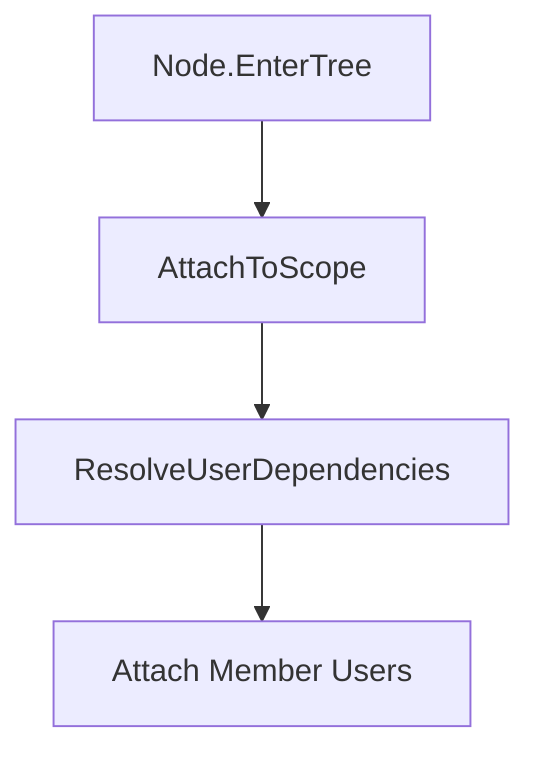

# 📘 GodotSharp.DI

**A developer‑friendly dependency injection framework for Godot C#**

GodotSharp.DI 让 Godot C# 拥有真正的依赖注入体验： 无需反射、无需运行时扫描、无需手写容器，所有内容都由 **Source Generator** 自动生成。

它的目标是：

- **简单易用**
- **高性能（零反射）**
- **强静态分析（编译期错误）**
- **与 Godot 生命周期完美融合**
- **适合游戏开发者**

# 📑 目录

1. Why GodotSharp.DI?
2. QuickStart
3. How it works
4. Roles: Host / User / Service / Scope
5. Lifecycle Model
6. Thread Safety
7. Code Generation
8. Diagnostics
9. Examples
10. Roadmap / TODO

# 1. **Why GodotSharp.DI?**

Godot C# 缺少一个真正适合游戏开发的 DI 框架。 常见问题包括：

- 反射太慢
- 生命周期难以管理
- Node 之间依赖混乱
- 服务初始化顺序不可控
- 多 Scope 难以实现
- 线程安全问题难以排查

GodotSharp.DI 解决了这些问题：

- **零反射**（全部编译期生成）
- **强语义角色系统**（Host / User / Service / Scope）
- **自动注入**（绑定 Godot 生命周期）
- **自动服务注册**
- **自动依赖图验证**
- **自动生成代码**
- **自动线程安全检查（Debug 模式）**

# 2. **QuickStart**

### 1. 定义 Service

csharp

```
[Singleton(typeof(IConfig))]
public partial class ConfigService : IConfig { }
```

### 2. 定义 Host（必须是 Node）

csharp

```
[Host]
public partial class GameHost : Node
{
    [Singleton(typeof(IConfig))]
    private ConfigService Config { get; } = new();
}
```

### 3. 定义 Scope（必须是 Node）

csharp

```
[Modules(Instantiate = [typeof(ConfigService)], Expect = [typeof(GameHost)])]
public partial class GameScope : Node, IScope { }
```

### 4. 定义 User

csharp

```
[User]
public partial class PlayerUI : Control, IServicesReady
{
    [Inject] private IConfig _config;

    public void OnServicesReady()
    {
        GD.Print(_config.SomeValue);
    }
}
```

# 3. **How it works**

GodotSharp.DI 使用 Source Generator 自动生成：

- Service 构造函数工厂
- Host Attach/Unattach
- User 注入逻辑
- Scope 生命周期
- 成员级递归注入
- 依赖图验证
- 线程安全断言（Debug）

你写的只是标记（Attributes）， 框架会自动生成所有 DI 代码。

# 4. **Roles: Host / User / Service / Scope**

## 🟥 Service

- 由 Host 注册
- 构造函数注入
- 必须是非 Node
- 生命周期由 Scope 管理

## 🟦 User

- 消费服务
- 字段/属性注入
- 可以是 Node 或非 Node
- 注入由宿主 Node 自动触发
- 不影响 Scope

### 非 Node User 注入机制



## 🟥 Host

- **必须是 Node**
- 注册服务
- 生命周期绑定 EnterTree / ExitTree
- 不允许作为成员嵌套
- 不允许构造函数注入

## 🟩 Host + User

- 必须是 Node
- 先注册服务，再注入依赖
- OnServicesReady 在依赖全部就绪后触发

## 🟧 Scope

- 必须是 Node
- 管理服务生命周期
- 构造 Service
- 注入 User
- 注册 Host

# 5. **Lifecycle Model**

mermaid

```
flowchart TD
    A[Node.EnterTree] --> B[AttachHostServices]
    B --> C[ResolveUserDependencies]
    C --> D[OnServicesReady]
    D --> E[Node.Ready]
    E --> F[Node.ExitTree]
    F --> G[UnattachHostServices]
```

# 6. **Thread Safety**

GodotSharp.DI 是 **主线程 DI 框架**。

### ❌ 以下方法绝不能在后台线程调用：

- ResolveDependency
- RegisterService / UnregisterService
- GetService
- InstantiateScopeSingletons
- DisposeScopeSingletons
- ResolveUserDependencies
- CreateService
- OnDependencyResolved
- OnServicesReady

### ✔ 正确模式

csharp

```
Task.Run(() =>
{
    var data = ProcessData();
    CallDeferred(nameof(RegisterServiceOnMainThread), data);
});
```

# 7. **Code Generation**

生成器自动生成：

- Service 构造函数工厂
- Host Attach/Unattach
- User 注入逻辑
- Scope 生命周期
- 成员级递归 Attach/Unattach
- Debug 信息（可选）

生成器流程：

代码

```
ClassTypeValidator → TypeInfo → DiGraph → Generators
```

# 8. **Diagnostics**

## ❌ 禁止手动注入

### **GDI-U-004：禁止手动调用 AttachToScope()**

代码

```
禁止手动调用 AttachToScope。注入应由宿主 Node 的生命周期自动触发。
```

### **GDI-U-005：禁止手动调用 ResolveUserDependencies()**

代码

```
禁止手动调用 ResolveUserDependencies。依赖注入必须由框架自动执行。
```

# 9. **Examples**

## Host + User

csharp

```
[Host, User]
public partial class GameManager : Node
{
    [Inject] private IConfig _config;

    public IGameState CreateGameState() => new GameState();

    public void OnServicesReady()
    {
        GD.Print("GameManager ready");
    }
}
```

# 10.**Rules Table**

| 角色      | Inject | InjectConstructor | Singleton | Transient | Host | User | Modules | 非 Node | Node |
| --------- | ------ | ----------------- | --------- | --------- | ---- | ---- | ------- | ------- | ---- |
| Service   | ❌      | ✔                 | ✔         | ✔         | ❌    | ❌    | ❌       | ✔       | ❌    |
| User      | ✔      | ❌                 | ❌         | ❌         | ❌    | ✔    | ❌       | ✔       | ✔    |
| Host      | ❌      | ❌                 | ✔(成员)   | ❌         | ✔    | ❌    | ❌       | ❌       | ✔    |
| Host+User | ✔      | ❌                 | ✔(成员)   | ❌         | ✔    | ✔    | ❌       | ❌       | ✔    |
| Scope     | ❌      | ❌                 | ❌         | ❌         | ❌    | ❌    | ✔       | ❌       | ✔    |

# 11. **Roadmap / TODO**

- 文档完善
- 多语言支持（.resx）
- 完整 Diagnostics.md
- 性能优化
- Scope 继承
- Debug 调试工具
- 示例项目
- ECS 集成示例


# 📘 DI 类型约束总表

这张表格总结了 GodotSharp.DI 中所有与类型相关的语义约束。 每个角色的职责、允许/禁止的类型、生命周期规则都在此一目了然。

## 🟦 1. 角色类型约束（Service / Host / User / Scope）

| 角色        | 必须是 | 是否 Node | 是否允许标记 | 是否可作为 Service | 是否可被注入           | 是否可暴露类型 | 说明                           |
| ----------- | ------ | --------- | ------------ | ------------------ | ---------------------- | -------------- | ------------------------------ |
| **Service** | class  | ❌ 否      | 无           | ✔ 是               | ✔ 是（按 Inject 规则） | ✔ 必须暴露接口 | 纯逻辑服务，由 Scope 创建      |
| **Host**    | class  | ✔ 是      | Host ✔       | ❌ 否               | ❌ 否                   | ❌ 否           | 场景级资源提供者，不参与 DI 图 |
| **User**    | class  | ✔ 是      | User ✔       | ❌ 否               | ✔ 是（按 Inject 规则） | ❌ 否           | 依赖消费者，由 Scope 注入      |
| **Scope**   | class  | ❌ 否      | Scope ✔      | ❌ 否               | ❌ 否                   | ❌ 否           | DI 容器根节点，管理生命周期    |

## 🟩 2. 注入类型（Inject Type）约束

| 条目                       | 是否允许 | 说明                          |
| -------------------------- | -------- | ----------------------------- |
| interface                  | ✔        | 推荐方式                      |
| class                      | ✔        | 但不能是 Node/Host/User/Scope |
| Node                       | ❌        | 生命周期由 Godot 控制         |
| Host                       | ❌        | Host 不可被注入               |
| User                       | ❌        | User 不可被注入               |
| Scope                      | ❌        | Scope 不可被注入              |
| abstract class             | ❌        | 无法实例化                    |
| static class               | ❌        | 无法实例化                    |
| array / pointer / delegate | ❌        | 不支持                        |
| dynamic                    | ❌        | 不可分析                      |
| 开放泛型                   | ❌        | 不可实例化                    |

## 🟧 3. Service 实现类型（Service Type）约束

| 条目                       | 是否允许 | 说明               |
| -------------------------- | -------- | ------------------ |
| class                      | ✔        | 必须是 class       |
| sealed class               | ✔        | 推荐               |
| abstract class             | ❌        | 无法实例化         |
| static class               | ❌        | 无法实例化         |
| Node                       | ❌        | 生命周期冲突       |
| Host                       | ❌        | Host 不是 Service  |
| User                       | ❌        | User 不是 Service  |
| Scope                      | ❌        | Scope 不是 Service |
| interface                  | ❌        | 不能作为实现类型   |
| 开放泛型                   | ❌        | 无法实例化         |
| array / pointer / delegate | ❌        | 不支持             |
| dynamic                    | ❌        | 不可分析           |

## 🟦 4. 暴露类型（Exposed Service Type）约束

| 条目                       | 是否允许 | 说明                     |
| -------------------------- | -------- | ------------------------ |
| interface                  | ✔        | 必须是接口               |
| class                      | ❌        | 实现类型不能作为暴露类型 |
| abstract class             | ❌        | 不允许                   |
| Node                       | ❌        | 不允许                   |
| Host/User/Scope            | ❌        | 不允许                   |
| 开放泛型                   | ❌        | 不允许                   |
| array / pointer / delegate | ❌        | 不允许                   |
| dynamic                    | ❌        | 不允许                   |

## 🟩 5. User Inject 成员约束

| 条目                      | 是否允许 | 说明          |
| ------------------------- | -------- | ------------- |
| 成员类型满足 Inject Type  | ✔        | 必须          |
| 字段                      | ✔        | 推荐          |
| 属性（带 setter）         | ✔        | 必须有 setter |
| 属性（无 setter）         | ❌        | 无法注入      |
| static 成员               | ❌        | 不允许        |
| Node/Host/User/Scope 类型 | ❌        | 不允许        |

## 🟧 6. Host Singleton 成员约束

| 条目                               | 是否允许 | 说明                     |
| ---------------------------------- | -------- | ------------------------ |
| 成员类型满足 Service Type          | ✔        | 必须                     |
| 暴露类型满足 Exposed Type          | ✔        | 必须                     |
| 字段                               | ✔        | 推荐                     |
| 属性（带 getter）                  | ✔        | 必须有 getter            |
| 属性（无 getter）                  | ❌        | 无法读取实例             |
| static 成员                        | ❌        | 不允许                   |
| 实现类型带 [Singleton]/[Transient] | ❌        | 必须禁止（双重生命周期） |
| 实现类型是 Host/User/Scope/Node    | ❌        | 不允许                   |
| 实现类型是 Host 自身               | ❌        | 不允许                   |

## 🟦 7. 暴露类型冲突规则（Service vs Host Singleton）

| 情况                                            | 是否允许 | 说明             |
| ----------------------------------------------- | -------- | ---------------- |
| 同一个接口由 Service 注册                       | ✔        | 合法             |
| 同一个接口由 Host Singleton 注册                | ✔        | 合法             |
| 同一个接口同时由 Service 和 Host Singleton 注册 | ❌        | 必须报错（冲突） |

# 🟩 8. 最终语义总结

- **Service**：class，非 Node，暴露接口，由 Scope 创建
- **Host**：Node，提供 Host Singleton，不参与 DI 图
- **User**：Node或非Node，注入依赖，不提供服务
- **Scope**：Node，容器根，不可注入
- **Inject Type**：interface 或 class（非 Node/Host/User/Scope）
- **Exposed Type**：必须是 interface
- **Host Singleton**：实现类型必须是 Service Type，不能带生命周期标记
- **User Inject**：成员类型必须是 Inject Type
