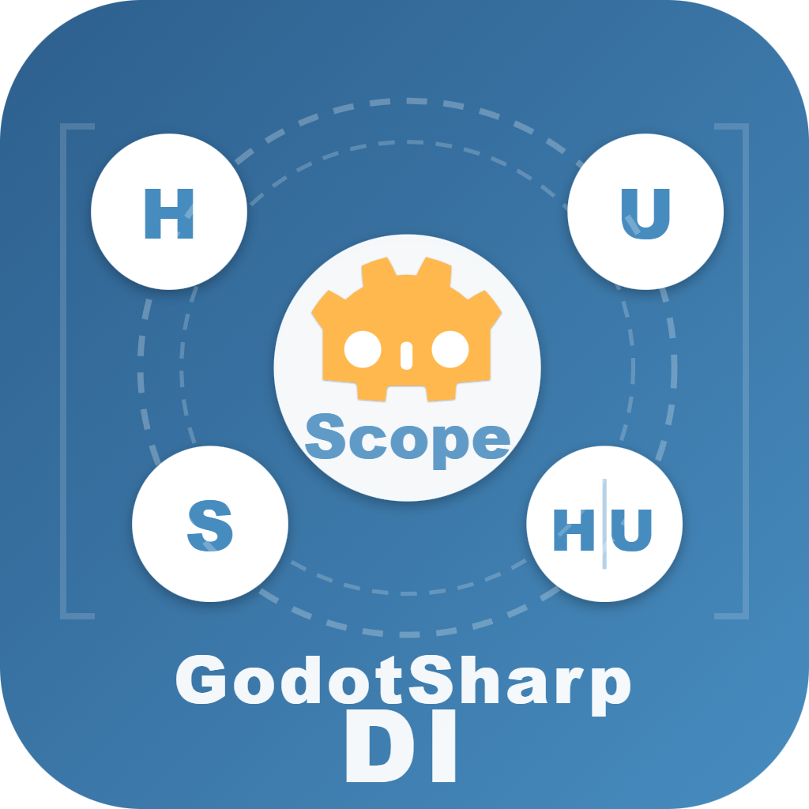

# GodotSharpDI



<p align="left"> <a href="README.md">English</a> </p>

一个专为 Godot 4 设计的编译时依赖注入框架，通过 C# 源生成器实现零反射、高性能的 DI 支持。

[](https://www.nuget.org/packages/GodotSharpDI/)

## 目录

- [设计理念](#设计理念)
- [安装](#安装)
- [快速开始](#快速开始)
  - [1. 定义服务](#1-定义服务)
  - [2. 定义服务工厂](#2-定义服务工厂)
  - [3. 定义 Scope](#3-定义-scope)
  - [4. 定义 Host](#4-定义-host)
  - [5. 定义 User](#5-定义-user)
  - [6. 场景树结构](#6-场景树结构)
- [核心概念](#核心概念)
  - [四种角色类型](#四种角色类型)
  - [服务生命周期](#服务生命周期)
- [角色详解](#角色详解)
  - [单例服务](#单例服务)
  - [Host (宿主)](#host-宿主)
  - [User (消费者)](#user-消费者)
  - [Scope (容器)](#scope-容器)
- [生命周期管理](#生命周期管理)
  - [Singleton 生命周期](#singleton-生命周期)
  - [Scope 层级](#scope-层级)
  - [依赖注入时序](#依赖注入时序)
  - [Host + User 与循环依赖](#host--user-与循环依赖)
- [类型约束](#类型约束)
  - [角色类型约束](#角色类型约束-1)
  - [注入类型约束](#注入类型约束)
  - [服务实现类型约束](#服务实现类型约束)
  - [暴露类型约束](#暴露类型约束)
  - [其他约束](#其他约束)
- [API 参考](#api-参考)
  - [特性 (Attributes)](#特性-attributes)
  - [接口 (Interfaces)](#接口-interfaces)
  - [生成的代码](#生成的代码)
  - [场景树集成](#场景树集成)
- [最佳实践](#最佳实践)
  - [Scope 粒度设计](#scope-粒度设计)
  - [服务释放](#服务释放)
  - [避免循环依赖](#避免循环依赖)
  - [接口优先原则](#接口优先原则)
  - [Host + User 组合使用](#host--user-组合使用)
  - [使用服务工厂](#使用服务工厂)
- [诊断代码](#诊断代码)
- [许可证](#许可证)
- [Todo List](#todo-list)

---

## 设计理念

GodotSharpDI 的核心设计理念是**将 Godot 的场景树生命周期与传统 DI 容器模式融合**：

- **场景树即容器层级**：利用 Godot 的场景树结构实现作用域 (Scope) 层级
- **Node 生命周期集成**：服务的创建和销毁与 Node 的进入/退出场景树事件绑定
- **编译时安全**：通过 Source Generator 在编译期完成依赖分析和代码生成，提供完整的编译时错误检查

---

## 安装软件包

```xml
<PackageReference Include="GodotSharpDI" Version="x.x.x" />
```
⚠️ **确保项目中同时添加了 GodotSharp 软件包** ：生成的代码依赖 Godot.Node 和 Godot.GD 。

⚠️ **重要：需要显式声明 _Notification 方法**

> **从 1.0.0-rc.1 版本开始**，所有 Host、User 和 Scope 类型**必须**在节点绑定的 C# 脚本中显式定义 `_Notification` 方法：
>
> ```csharp
> public override partial void _Notification(int what);
> ```
>
> ### 为什么要这样做？
>
> - 在 Godot 中将 C# 脚本附加到节点时，引擎会在节点和该特定脚本文件之间创建绑定
> - Godot 的脚本绑定机制只扫描附加的脚本文件以查找虚方法重写
> - 源代码生成的文件（*.g.cs）通过 `partial` 编译到同一个类中，但 Godot 不会扫描这些文件来查找生命周期方法
> - 因此，像 `_Notification` 这样的生命周期钩子必须在节点脚本中声明为 `partial` 方法
>
> ### IDE 支持
>
> IDE（Visual Studio、Rider）会提供自动修复：
>
> 1. 如果忘记添加此方法，会产生 **GDI_C080** 错误
> 2. 在错误上按 `Ctrl+.`（VS）或 `Alt+Enter`（Rider）
> 3. 选择“添加 _Notification 方法声明”以自动生成正确的声明
>
> ### 示例：
>
> ```csharp
> // GameManager.cs（附加到节点）
> [Host]
> public partial class GameManager : Node
> {
>     // 必需：Godot 需要看到这个声明
>     public override partial void _Notification(int what);
>     
>     [Singleton(typeof(IGameState))]
>     private IGameState Self => this;
> }
> 
> // 生成的文件：GameManager.DI.g.cs（不被 Godot 扫描）
> partial class GameManager
> {
>     // 框架提供实现
>     public override partial void _Notification(int what)
>     {
>         base._Notification(what);
>         switch ((long)what)
>         {
>             case NotificationEnterTree:
>                 AttachToScope();
>                 break;
>             case NotificationExitTree:
>                 UnattachToScope();
>                 break;
>         }
>     }
> }
> ```
>

---

## 快速开始

### 1. 定义服务

```csharp
// 定义服务接口
public interface IPlayerStats
{
    int Health { get; set; }
    int Mana { get; set; }
}

// 实现服务
[Singleton(typeof(IPlayerStats))]
public partial class PlayerStatsService : IPlayerStats
{
    public int Health { get; set; } = 100;
    public int Mana { get; set; } = 50;
}
```

### 2. 定义服务工厂

```csharp
// 定义服务接口
public interface IEnemySpawner
{
    Enemy SpawnEnemy();
}

// 实现服务工厂
[Singleton(typeof(IEnemySpawner))]
public partial class EnemyFactory : IEnemySpawner
{
    private IPlayerStats _playerStats;
    
    // 从构造函数注入依赖
    [InjectConstructor]
    public EnemyFactory(IPlayerStats playerStats)
    {
        _playerStats = playerStats;
    }
    
    public Enemy SpawnEnemy()
    {
        // 向动态对象传递依赖
        return new Enemy(_playerStats);
    }
}
```

### 3. 定义 Scope

```csharp
[Modules(
    Services = [typeof(PlayerStatsService), typeof(EnemyFactory)],
    Hosts = [typeof(GameManager)]
)]
public partial class GameScope : Node, IScope
{
    // 框架自动生成 IScope 实现
    
    // 需要集成 Godot 生命周期
    public override partial void _Notification(int what);
}
```

### 4. 定义 Host

```csharp
[Host]
public partial class GameManager : Node, IGameState
{
    // 将自己暴露为 IGameState 服务
    [Singleton(typeof(IGameState))]
    private GameManager Self => this;
    
    public GameState CurrentState { get; set; }
    
    // 需要集成 Godot 生命周期
    public override partial void _Notification(int what);
}
```

### 5. 定义 User

```csharp
[User]
public partial class PlayerUI : Control, IServicesReady
{
    [Inject] private IPlayerStats _stats;
    [Inject] private IGameState _gameState;
    
    // 所有依赖注入完成后调用
    public void OnServicesReady()
    {
        UpdateUI();
    }
    
    // 需要集成 Godot 生命周期
    public override partial void _Notification(int what);
}
```

### 6. 场景树结构

```
GameScope (IScope
├── GameManager (Host)
└── PlayerUI (User) ← 自动接收注入
```

---

## 核心概念

### 四种角色类型

| 角色 | 说明 | 约束 |
|------|------|------|
| **单例服务** | 纯逻辑服务，在 Scope 内唯一，由 Scope 创建和管理，Scope 销毁时释放 | 必须是非 Node 的 class |
| **Host** | 场景级资源提供者，将 Node 资源桥接到 DI 世界 | 必须是 Node |
| **User** | 依赖消费者，接收注入 | 必须是 Node |
| **Scope** | DI 容器，管理服务生命周期 | 必须是 Node，实现 IScope |

---

## 角色详解

### 单例服务

#### 职责

标记为 [Singleton] 的类型是纯逻辑服务，封装业务逻辑和数据处理，**不依赖 Godot Node 系统**。

#### 约束

| 约束项 | 要求 | 原因 |
|--------|------|------|
| 类型 | 必须是 class | 需要实例化 |
| 继承 | 不能是 Node | Node 生命周期由 Godot 控制,与 DI 容器冲突 |
| 修饰符 | 不能是 abstract 或 static | 需要实例化 |
| 泛型 | 不能是开放泛型 | 需要具体类型来实例化 |
| 声明 | 必须是 partial | 源生成器需要扩展类 |

#### 生命周期标记

```csharp
// Singleton: Scope 内唯一实例
[Singleton(typeof(IPlayerStats))]
public partial class PlayerStatsService : IPlayerStats { }
```

#### 构造函数注入

单例服务通过构造函数注入依赖：

```csharp
[Singleton(typeof(ICombatSystem))]
public partial class CombatSystem : ICombatSystem
{
    private readonly IPlayerStats _stats;
    private readonly IWeaponFactory _weapons;
    
    public CombatSystem(IPlayerStats stats, IWeaponFactory weapons)
    {
        _stats = stats;
        _weapons = weapons;
    }
}
```

**构造函数选择规则**:

1. 使用标记为 `[InjectConstructor]` 的构造函数
2. 只有一个构造函数时则作为默认构造函数，无论是否标记为 `[InjectConstructor]` 
3. 如果有多个构造函数，必须指定唯一的 `[InjectConstructor]`

```csharp
[Singleton(typeof(IService))]
public partial class MyService : IService
{
    // 多个构造函数时,必须指定
    [InjectConstructor]
    public MyService(IDep1 dep1) { }
    
    public MyService(IDep1 dep1, IDep2 dep2) { }
}
```

#### 暴露类型

通过 [Singleton] 参数指定暴露的服务类型：

```csharp
// 暴露单个接口
[Singleton(typeof(IPlayerStats))]
public partial class PlayerStatsService : IPlayerStats { }

// 暴露多个接口
[Singleton(typeof(IReader), typeof(IWriter))]
public partial class FileService : IReader, IWriter { }

// 不指定参数时,暴露类本身 (不推荐)
[Singleton]  // 暴露 ConfigService 类型
public partial class ConfigService { }
```

> ⚠️ **最佳实践**： 始终暴露接口而非具体类，以保持松耦合和可测试性。

---

### Host (宿主)

#### 职责

Host 是 Godot Node 系统与 DI 系统之间的桥梁，它将 Node 管理的资源暴露为可注入的服务。

#### 约束

| 约束项        | 要求                                                         | 原因                                         |
| ------------- | ------------------------------------------------------------ | -------------------------------------------- |
| 类型          | 必须是 class                                                 | 需要实例化                                   |
| 继承          | 必须继承自 Node                                              | 需要与场景树生命周期集成                     |
| 声明          | 必须是 partial                                               | 源生成器需要扩展类                           |
| _Notification | 必须声明 `public override partial void _Notification(int what);` | Godot 只识别附加脚本文件中定义的生命周期方法 |

#### 静态性约束

Host 是 Scope 的**静态**组成部分，不是动态服务提供者。

**❌ 不应该：**

* 在运行时 reparent 
* 动态添加/移除 Host 
* 期望 Host 在不同 Scope 间迁移

**✅ 应该：**

* 将 Host 视为 Scope 节点树的固定部分
* 在场景设计时确定 Host 的位置
* 将 Host 作为 Scope 的场景树子节点，由 Scope 销毁时清理
* 如需动态服务，应使用服务工厂模式（参考 **[使用服务工厂](#使用服务工厂)** 小节）

> 这样的约束让 Scope 在其作用域内具有单例特性。与传统全局单例相比，Scope 能够主动限制自己的影响范围——通过场景树的层级关系自然划分服务边界。这使得场景结构更加灵活且可控，User 可以在场景树的各个层级方便地获取所需依赖，而不会产生全局污染。
>
> 简而言之，将 Scope 和 Host 视为场景树中稳定的“锚定点”，Host 是 Scope 用于拆分逻辑和管理资源的“功能模块”。

#### 典型使用模式

**模式 1： Host 暴露自身**

```csharp
[Host]
public partial class ChunkManager : Node3D, IChunkGetter, IChunkLoader
{
    [Singleton(typeof(IChunkGetter), typeof(IChunkLoader))]
    private ChunkManager Self => this;
    
    // Node 管理的资源
    private Dictionary<Vector3I, Chunk> _chunks = new();
    
    // 实现接口
    public Chunk GetChunk(Vector3I pos) => _chunks.GetValueOrDefault(pos);
    public void LoadChunk(Vector3I pos) { /* ... */ }
    
    // 需要集成 Godot 生命周期
    public override partial void _Notification(int what);
}
```

这是 Host 最典型的使用方式：Node 自身实现服务接口，并将自己暴露给 DI 系统。

**模式 2： Host 持有并暴露其他对象**

```csharp
[Host]
public partial class WorldManager : Node
{
    [Singleton(typeof(IWorldConfig))]
    private WorldConfig _config = new();
    
    [Singleton(typeof(IWorldState))]
    private WorldState _state = new();
    
    // 需要集成 Godot 生命周期
    public override partial void _Notification(int what);
}

public class WorldConfig : IWorldConfig { /* ... */ }
public class WorldState : IWorldState { /* ... */ }
```

Host 可以持有和管理其他对象，并将它们暴露为服务。**这些对象的生命周期由 Host 控制。**

#### Host 成员约束

| 约束项 | 要求 | 原因 |
|--------|------|------|
| 成员类型 | 不能是已标记为 Service 的类型 | 避免生命周期冲突 |
| static 成员 | 不允许 | 需要实例级别的服务 |
| 属性 | 必须有 getter | 需要读取值来注册服务 |

```csharp
// ❌ 错误：标记为 [Singleton]的类型只能由 Scope 持有
[Singleton(typeof(IConfig))]
public partial class ConfigService : IConfig { }

[Host]
public partial class BadHost : Node
{
    [Singleton(typeof(IConfig))]
    private ConfigService _config = new();  // 编译错误 GDI_M050
    
    // 需要集成 Godot 生命周期
    public override partial void _Notification(int what);
}

// ✅ 正确：使用注入而非持有
[Host, User]
public partial class GoodHost : Node
{
    [Singleton(typeof(ISelf))]
    private ISelf Self => this;
    
    [Inject]
    private IConfig _config;  // 通过注入获取 Service
    
    // 需要集成 Godot 生命周期
    public override partial void _Notification(int what);
}
```

---

### User (消费者)

#### 职责

User 是依赖消费者，通过字段或属性注入接收服务依赖。

#### 约束

| **约束项**    | 要求                                                         | 原因                                         |
| ------------- | ------------------------------------------------------------ | -------------------------------------------- |
| 类型          | 必须是 class                                                 | 需要实例化                                   |
| 继承          | 必须继承自 Node                                              | 需要与场景树生命周期集成                     |
| 声明          | 必须是 partial                                               | 源生成器需要扩展类                           |
| _Notification | 必须声明 `public override partial void _Notification(int what);` | Godot 只识别附加脚本文件中定义的生命周期方法 |

#### User 自动注入依赖

```csharp
[User]
public partial class PlayerController : CharacterBody3D, IServicesReady
{
    [Inject] private IPlayerStats _stats;
    [Inject] private ICombatSystem _combat;
    
    // 当所有依赖注入完成后自动调用
    public void OnServicesReady()
    {
        GD.Print("所有服务已就绪，可以开始游戏逻辑");
    }
    
    // 需要集成 Godot 生命周期
    public override partial void _Notification(int what);
}
```

Node 类型的 User 会在进入场景树时自动触发注入，无需手动操作。

#### Inject 成员约束

| 约束项 | 要求 | 原因 |
|--------|------|------|
| 成员类型 | interface 或普通 class | 必须是可注入类型 |
| 成员类型 | 不能是 Node/Host/User/Scope | 这些不是服务类型 |
| static 成员 | 不允许 | 需要实例级别的注入 |
| 属性 | 必须有 setter | 需要写入注入值 |

```csharp
[User]
public partial class MyUser : Node
{
    [Inject] private IService _service;           // ✅ 正确
    [Inject] private MyConcreteClass _concrete;   // ✅ 允许但不推荐
    [Inject] private Node _node;                  // ❌ 错误
    [Inject] private MyHost _host;                // ❌ 错误
    [Inject] private static IService _static;     // ❌ 错误
    
    // 需要集成 Godot 生命周期
    public override partial void _Notification(int what);
}
```

#### IServicesReady 接口

实现 `IServicesReady` 接口可以在所有依赖注入完成后收到通知：

⚠️ **`OnServicesReady()` 始终在 `_Ready()` 之后被调用**，因为 User 在 NotificationReady 处开始依赖解析。

```csharp
[User]
public partial class MyComponent : Node, IServicesReady
{
    [Inject] private IServiceA _a;
    [Inject] private IServiceB _b;
    [Inject] private IServiceC _c;
    
    // 当 _a, _b, _c 都注入完成后调用
    public void OnServicesReady()
    {
        // 安全地使用所有依赖
        Initialize();
    }
    
    // 需要集成 Godot 生命周期
    public override partial void _Notification(int what);
}
```

---

### Scope (容器)

#### 职责

Scope 是 DI 容器，负责：

1. 创建和管理 单例服务实例
2. 收集 Host 所提供的服务实例
3. 处理依赖解析请求
4. 管理自己创建的服务实例的生命周期

#### 约束

| **约束项**    | 要求                                                         | 原因                                         |
| ------------- | ------------------------------------------------------------ | -------------------------------------------- |
| 类型          | 必须是 class                                                 | 需要实例化                                   |
| 继承          | 必须继承自 Node                                              | 需要与场景树生命周期集成                     |
| 接口          | 必须实现 IScope                                              | 提供服务注册 API                             |
| Modules       | 必须指定 [Modules]                                           | 定义服务组合                                 |
| 声明          | 必须是 partial                                               | 源生成器需要扩展类                           |
| _Notification | 必须声明 `public override partial void _Notification(int what);` | Godot 只识别附加脚本文件中定义的生命周期方法 |

#### 静态性约束

Scope 是场景树中的**静态服务容器**，具有明确的作用域边界。

**❌ 不应该：**

- 在运行时动态创建/销毁 Scope（除非整个子场景需要卸载）
- 期望 Scope 在场景树中频繁移动位置
- 将 Scope 用作临时的服务缓存或动态服务池
- 在运行时改变 Scope 的父子关系来"切换"服务作用域

**✅ 应该：**

- 将 Scope 视为场景树结构的**固定骨架节点**
- 在场景设计阶段确定 Scope 的层级和位置
- Scope 的生命周期与其对应的场景区域同步
- Scope 随其场景节点一起创建和销毁
- 如需动态服务，应在 Scope 内注册服务工厂（参考 **[使用服务工厂](#使用服务工厂)** 小节）

> 这样的约束让 Scope 在其作用域内具有单例特性。与传统全局单例相比，Scope 能够主动限制自己的影响范围——通过场景树的层级关系自然划分服务边界。这使得场景结构更加灵活且可控，User 可以在场景树的各个层级方便地获取所需依赖，而不会产生全局污染。
>
> 简而言之，将 Scope 视为场景树中稳定的"锚定点"，它定义了服务的可见范围，而 Host 则是 Scope 用于拆分逻辑和管理资源的"功能模块"。

> **Host vs Scope 的静态性**
>
> | 维度           | Host                | Scope              |
> | -------------- | ------------------- | ------------------ |
> | **本质**       | Scope 的组成部分    | 场景树的结构节点   |
> | **作用域**     | 无独立作用域        | 定义服务作用域边界 |
> | **静态性含义** | 不能在 Scope 间迁移 | 不能频繁创建/销毁  |
> | **生命周期**   | 随 Scope 销毁       | 随场景区域生命周期 |

#### 定义 Scope

```csharp
[Modules(
    Services = [typeof(PlayerStatsService), typeof(CombatSystem)],
    Hosts = [typeof(GameManager), typeof(WorldManager)]
)]
public partial class GameScope : Node, IScope
{
    // 框架自动生成所有 IScope 实现
    
    // 需要集成 Godot 生命周期
    public override partial void _Notification(int what);
}
```

**Modules 参数说明**：

| 参数 | 说明 | 约束 |
|------|------|------|
| `Services` | Scope 创建和管理的 服务类型列表 | 必须是服务（有 [Singleton]） |
| `Hosts` | Scope 期望接收的 Host 类型列表 | 必须是 Host（有 [Host]） |

#### Scope 层级

Scope 通过场景树结构形成层级关系：

```
RootScope
├── GameManager (Host)
├── GlobalServices...
│
└── LevelScope
 ├── LevelManager (Host)
 ├── LevelServices...
 │
 └── Player
     └── PlayerUI (User)
```

**依赖解析规则**:

1. 首先在当前 Scope 查找
2. 如果未找到且服务类型不属于当前 Scope，向父 Scope 查找
3. 递归直到根 Scope 或找到服务

#### Scope 生命周期事件

| 事件 | 触发时机 | 行为 |
|------|----------|------|
| `NotificationReady` | Node 准备就绪 | 创建所有 Singleton Service |
| `NotificationPredelete` | Node 即将删除 | 释放所有 Service (调用 IDisposable.Dispose) |

---

## 生命周期管理

### 单例生命周期

#### 创建时机
单例服务在以下时机创建：
1. **Scope 就绪时**：当 Scope 的 `NotificationReady` 事件触发时，[Modules] 中指定的所有服务都会被创建
2. **按需创建**：当依赖请求到来且服务尚未创建时

#### 销毁时机
单例服务在以下时机销毁：
1. **Scope 销毁时**：当 Scope 的 `NotificationPredelete` 事件触发时
2. **IDisposable 支持**：实现 `IDisposable` 的服务会调用其 `Dispose()` 方法
```csharp
[Singleton(typeof(IResourceManager))]
public partial class ResourceManager : IResourceManager, IDisposable
{
    public void Dispose()
    {
        // 释放资源
    }
}
```

---

### Scope 层级结构

#### 服务可见性规则

| 服务位置 | 可访问范围 |
|---------|-----------|
| RootScope | 所有后代 Scope |
| GameScope | GameScope 和 LevelScope |
| LevelScope | 仅 LevelScope |

**示例**：

```csharp
// RootScope
[Modules(Services = [typeof(ConfigService)])]
public partial class RootScope : Node, IScope { }

// GameScope 可以访问 ConfigService
[Modules(Services = [typeof(PlayerService)])]
public partial class GameScope : Node, IScope { }

// LevelScope 可以访问 ConfigService 和 PlayerService
[Modules(Services = [typeof(EnemyService)])]
public partial class LevelScope : Node, IScope { }
```

---

### 依赖注入时序

#### 单例服务创建时序
```
Scope 节点就绪 (NotificationReady)
    ↓
Scope.InstantiateScopeSingletons()
    ↓
对于 Modules.Services 中的每个服务：
    ↓
    Service.CreateService()
    ↓
    对于每个构造函数参数：
        ↓
        Scope.ResolveDependency<T>()
    ↓
    所有依赖都已解析？
    ↓
    是
    ↓
    scope.ProvideService<T>(service)
    ↓
    通知等待队列
```

#### User 的注入时序
```
User Node 准备完毕 (NotificationReady)
 ↓
GetServiceScope() ← 向上查找最近的 IScope
 ↓
ResolveUserDependencies(scope)
 ↓
scope.ResolveDependency<T>(callback) ← 每个 [Inject] 成员
 ↓
等待服务就绪或立即回调
 ↓
OnServicesReady() ← 所有依赖注入完成（如果实现 IServicesReady）
```

#### Host 的服务注册时序
```
Host Node 准备完毕 (NotificationReady)
 ↓
GetServiceScope() ← 向上查找最近的 IScope
 ↓
ProvideHostServices(scope)
 ↓
scope.ProvideService<T>(this.Member) ← 每个 [Singleton] 成员
 ↓
通知等待队列
```

---

### Host + User 与循环依赖

在 GodotSharpDI 中，一个类型可以同时标记为 `[Host, User]`,即既提供服务又消费服务。为了避免误判循环依赖,需要明确 Host 与 User 在生命周期和注入时序上的区别。

#### Host 与 User 的注入时序差异

**Host (服务提供者)**

- 在 **EnterTree** 阶段注册其 `[Singleton]` 成员提供的服务
- 注册服务时**不会触发任何依赖注入**
- 不会触发自身的 User 注入
- 不会触发其他 User 的注入

**User (服务消费者)**

- 在 **EnterTree** 阶段附着到最近的 Scope
- 立即对所有 `[Inject]` 成员发起依赖解析
- 如果服务尚未注册,则加入等待队列
- 在服务注册或 Scope Ready 时被回调注入
- 所有依赖注入完成后触发 `OnServicesReady()`

**结论**

> **Host 的服务注册阶段不参与依赖注入链。**
> **User 的依赖注入只在 Node 进入场景树后、或服务注册完成后触发。**

这条规则保证了 Host+User 不会因为"自提供、自消费"而形成循环依赖。

#### 示例 1: Host+User 自注入不是循环依赖

```csharp
public interface IMyService { }

[Host, User]
public partial class MyService : Node, IMyService
{
    [Singleton(typeof(IMyService))]
    private MyService Self => this;

    [Inject]
    private IMyService _self;
    
    // 需要集成 Godot 生命周期
    public override partial void _Notification(int what);
}
```

**依赖关系**

- Host 部分提供 `IMyService`
- User 部分消费 `IMyService`

**为什么不是循环依赖?**

1. Host 注册 `Self` 时**不会触发** `_self` **的注入**
2. `_self` 的注入发生在 User 注入阶段 (EnterTree → AttachToScope)
3. 此时 `IMyService` 已经注册,因此注入成功
4. 整个过程没有构造函数链路,也没有形成依赖闭环

**结论**

> **Host+User 自注入是合法的,不属于循环依赖。**

#### 示例 2: Host 提供服务 + 自身消费另一个 Service 也不是循环依赖

```csharp
public interface IServiceA { }
public interface IServiceB { }

[Singleton(typeof(IServiceA))]
public partial class ServiceA : IServiceA
{
    public ServiceA(IServiceB b) { }
}

[Host, User]
public partial class HostUser : Node, IServiceB
{
    [Singleton(typeof(IServiceB))]
    private HostUser Self => this;

    [Inject]
    private IServiceA _serviceA;
    
    // 需要集成 Godot 生命周期
    public override partial void _Notification(int what);
}
```

**依赖关系**

- `HostUser` (Host) 提供 `IServiceB`
- `ServiceA` 构造函数依赖 `IServiceB` → 注入 `HostUser`
- `HostUser` (User) 依赖 `IServiceA`

**为什么不是循环依赖?**

1. HostUser 注册 `IServiceB` 时**不会触发** `_serviceA` **的注入**
2. ServiceA 构造函数解析 `IServiceB` → 得到 HostUser
3. ServiceA 构造完成后，HostUser 的 `_serviceA` 在 User 注入阶段被赋值
4. 整个链路中没有构造函数环路

**依赖图如下**：

```
ServiceA → IServiceB (HostUser)
HostUser(User) → IServiceA
```

这是一个"菱形依赖"，不是循环。

**结论**

> **Host 提供服务 + 自身作为 User 消费其他服务是合法的,不属于循环依赖。**

#### 循环依赖检测的适用范围

GodotSharpDI 的循环依赖检测仅针对:

- **Service → Service 的构造函数依赖链**

不包括：

- User 的 `[Inject]` 成员
- Host 的 `[Singleton]` 成员
- Host+User 的自注入
- Host 与 User 之间的交叉依赖

原因：

> **User 注入发生在所有 Service 构造完成之后,不参与构造时的依赖闭环。**

因此，只有以下情况会被判定为循环依赖：

```csharp
[Singleton(typeof(IA))]
class A : IA { public A(IB b) {} }

[Singleton(typeof(IB))]
class B : IB { public B(IA a) {} }
```

#### 总结

| 情况 | 是否循环依赖 | 原因 |
|------|-------------|------|
| Host+User 自注入 | ❌ | Host 注册不触发注入,User 注入在之后 |
| Host 提供服务 + 自身作为 User 注入 | ❌ | 注入时序分离,不形成构造函数环 |
| Service ↔ Service 构造函数互相依赖 | ✔️ | 构造函数闭环 |

最终规则：

> **只要依赖链不在 Service 构造函数之间形成闭环，就不是循环依赖。Host+User 的注入时序天然避免构造函数循环。**

---

## 类型约束

> **术语说明**：
> - **Host + User**：同时标记了 Host 和 User 特性的节点
> - **非Node class**：不继承 Godot.Node 的普通 C# 类
> - **普通 Node**：继承 Node 但未标记特殊角色的节点

### 单例服务详细约束

**基本约束**

| 约束 | 要求 | 原因 |
|------|------|------|
| 类型 | class | 需要实例化 |
| 继承 | 不能是 Node | Node 生命周期由 Godot 控制 |
| 修饰符 | 不能是 abstract 或者 static | 需要实例化 |
| 声明 | 必须是 partial | 源生成器需要扩展 |

**类型约束**

| 类型 | 是否允许 | 说明 |
|------|----------|------|
| 非Node class | ✅ | **推荐** |
| Host / Host + User | ❌ | 应该通过成员提供服务 |
| 普通 Node | ❌ | 无静态约束，无法保证生命周期 |
| User | ❌ | 无静态约束，无法保证生命周期 |
| Scope | ❌ | 容器不能作为服务 |
| 其他类型 | ❌ | 不支持 |

**暴露类型约束**

| 类型 | 是否允许 | 说明 |
|------|----------|------|
| 已实现的 interface | ✅ | **推荐** |
| 已继承的 class | ✅ | 允许 |
| 未实现的 interface | ❌ | 无意义 |
| 未继承的 class | ❌ | 无意义 |

**构造函数约束**

| 约束 | 要求 |
|------|------|
| 可见性 | 至少有一个非静态构造函数 |
| 多构造函数 | 必须用 [InjectConstructor] 指定 |

**构造函数参数类型约束**

| 类型 | 是否允许 | 说明 |
|------|----------|------|
| interface | ✅ | **推荐方式** |
| 非Node class | ✅ | 允许 |
| Host / Host + User | ⚠️ | 允许但不推荐，应该依赖 Host 所暴露的接口 |
| 普通 Node | ❌ | 无静态约束，无法保证生命周期 |
| User | ❌ | 无静态约束，无法保证生命周期 |
| Scope | ❌ | 容器不能作为服务 |
| 其他类型 | ❌ | 不支持 |

---

### Host 详细约束

**基本约束**

| 约束 | 要求 | 原因 |
|------|------|------|
| 类型 | class | 需要实例化 |
| 继承 | 必须是 Node | 需要场景树生命周期 |
| 声明 | 必须是 partial | 源生成器需要扩展 |

**Host Singleton 成员类型约束**

| 类型 | 是否允许 | 说明 |
|------|----------|------|
| 非Node class | ✅ | **推荐** |
| Host / Host + User（自身类型） | ✅ | 可以将自己暴露为服务 |
| Host / Host + User（非自身类型） | ❌ | 不允许 Host 互相嵌套 |
| 普通 Node | ❌ | 无静态约束，无法保证生命周期 |
| User | ❌ | 无静态约束，无法保证生命周期 |
| Scope | ❌ | 不允许嵌套容器 |
| 其他类型 | ❌ | 不支持 |

**Host Singleton 成员暴露类型约束**

| 类型 | 是否允许 | 说明 |
|------|----------|------|
| 已实现的 interface | ✅ | **推荐** |
| 已继承的 class | ✅ | 允许 |
| 未实现的 interface | ❌ | 无意义 |
| 未继承的 class | ❌ | 无意义 |

---

### User 详细约束

**基本约束**

| 约束 | 要求 | 原因 |
|------|------|------|
| 类型 | class | 需要实例化 |
| 继承 | 必须是 Node | 需要场景树生命周期 |
| 声明 | 必须是 partial | 源生成器需要扩展 |

**User Inject 成员类型约束**

| 类型 | 是否允许 | 说明 |
|------|----------|------|
| interface | ✅ | **推荐方式** |
| 非Node class | ✅ | 允许 |
| Host / Host + User | ⚠️ | 允许但不推荐，应该依赖 Host 所暴露的接口 |
| 普通 Node | ❌ | 无静态约束，无法保证生命周期 |
| User | ❌ | 无静态约束，无法保证生命周期 |
| Scope | ❌ | 容器不能作为服务 |
| 其他类型 | ❌ | 不支持 |

---

### Scope 详细约束

| 约束 | 要求 | 原因 |
|------|------|------|
| 类型 | class | 需要实例化 |
| 继承 | 必须是 Node | 利用场景树实现层级 |
| 接口 | 必须实现 IScope | 框架识别标志 |
| 特性 | 必须有 [Modules] | 声明管理的服务 |
| 声明 | 必须是 partial | 源生成器需要扩展 |

---

## API 参考

### 特性

#### [Singleton]

标记一个类为 Singleton 生命周期的服务，或标记 Host 成员为暴露的服务。

```csharp
namespace GodotSharpDI.Abstractions;

[AttributeUsage(
    AttributeTargets.Class | AttributeTargets.Field | AttributeTargets.Property,
    Inherited = false,
    AllowMultiple = false
)]
public sealed class SingletonAttribute : Attribute
{
    public Type[] ExposedTypes { get; }
    
    public SingletonAttribute(params Type[] exposedTypes) { }
}
```
**使用场景**：

1. 在 Service 类上：将类标记为单例服务
2. 在 Host 成员上：将成员暴露为服务

**参数**：

* `serviceTypes`：要暴露的服务类型（接口或基类）
* 为空时：Service 类暴露自身；Host 成员暴露其自身类型
* 
#### [Host]

标记一个类为 Host (服务提供者)。

```csharp
namespace GodotSharpDI.Abstractions;

[AttributeUsage(AttributeTargets.Class, Inherited = false, AllowMultiple = false)]
public sealed class HostAttribute : Attribute { }
```

#### [User]

标记一个类为 User (服务消费者)。

```csharp
namespace GodotSharpDI.Abstractions;

[AttributeUsage(AttributeTargets.Class, Inherited = false, AllowMultiple = false)]
public sealed class UserAttribute : Attribute { }
```

#### [Inject]

标记一个字段或属性为注入目标。

```csharp
namespace GodotSharpDI.Abstractions;

[AttributeUsage(AttributeTargets.Field | AttributeTargets.Property, AllowMultiple = false)]
public sealed class InjectAttribute : Attribute { }
```

**使用规则**：

* 只能用于 User 或 Host+User 类型
* 成员必须可写（字段不能是 readonly，属性必须有 setter）
* 不能是 static

#### [InjectConstructor]

指定服务使用的构造函数。

```csharp
namespace GodotSharpDI.Abstractions;

[AttributeUsage(AttributeTargets.Constructor)]
public sealed class InjectConstructorAttribute : Attribute { }
```

**使用规则**：

* 只能用于单例服务类型
* 当存在多个构造函数时必须使用
* 必须唯一（只能标记一个构造函数）

#### ModulesAttribute

声明 Scope 管理的服务和期望的 Host。

```csharp
namespace GodotSharpDI.Abstractions;

[AttributeUsage(AttributeTargets.Class, Inherited = false, AllowMultiple = false)]
public sealed class ModulesAttribute : Attribute
{
    public Type[] Services { get; set; }
    public Type[] Hosts { get; set; }
}
```

**参数**：

| 参数 | 说明 |
|------|------|
| `Services` | Scope 创建和管理的 Service 类型列表 |
| `Hosts` | Scope 期望接收的 Host 类型列表 |

---

### 接口

#### IScope

DI 容器接口。

```csharp
namespace GodotSharpDI.Abstractions;

public interface IScope
{
    void ProvideService<T>(T instance) where T : notnull;
    void ResolveDependency<T>(Action<T> onResolved) where T : notnull;
}
```

方法：

| 方法                   | 描述     | 何时使用                     |
| ---------------------- | -------- | ---------------------------- |
| `ProvideService<T>`    | 提供服务 | 由框架自动调用，无需手动调用 |
| `ResolveDependency<T>` | 请求依赖 | 由框架自动调用，无需手动调用 |

> ⚠️ 重要提示：这些方法由框架管理，不应手动调用。框架会在 User、Host 和 Service 代码中生成适当的调用。

#### IServicesReady

服务就绪通知接口。

```csharp
namespace GodotSharpDI.Abstractions;

public interface IServicesReady
{
    void OnServicesReady();
}
```

**使用规则**：

* 只能由 User 或 Host+User 类型实现
* 在所有 [Inject] 成员解析完成后立即调用
* 适用于依赖注入服务的初始化逻辑

---

### 生成的代码

#### 节点声明周期相关方法

对于标记为 `[Host]` 、 `[User]` 或 `[Scope]` 的类型，框架生成：

```csharp
// Scope 引用
private IScope? _parentScope;

// 获取最近的 Scope
private IScope? GetParentScope();

// 生命周期通知处理
public override void _Notification(int what);
```

#### User 生成的方法

对于标记为 `[User]` 的类型，框架生成：

```csharp
// 解析用户依赖
private void ResolveUserDependencies();
```

#### Host 生成的方法

对于标记为 `[Host]` 的类型，框架生成：

```csharp
// 向 Scope 提供服务 
private void ProvideHostServices();
```

#### 单例服务生成的方法

对于标记为 `[Singleton]` 的单例服务，框架生成工厂方法：

```csharp
// 创建服务实例
public static void CreateService(
    IScope scope,
    Action<object, IScope> onCreated
);
```

#### Scope 生成的内容

对于实现 `IScope` 的类型，框架生成完整的容器实现：

```csharp
// 静态集合
private static readonly HashSet<Type> ServiceTypes;

// 实例字段
private readonly Dictionary<Type, object> _services;
private readonly Dictionary<Type, List<Action<object>>> _waiters;
private readonly HashSet<IDisposable> _disposableSingletons;

// 容器相关方法
private void InstantiateScopeSingletons();
private void DisposeScopeSingletons();
private void CheckWaitList();

// IScope 实现
void IScope.ProvideService<T>(T instance);
void IScope.ResolveDependency<T>(Action<T> onResolved);
```

---

### 场景树集成

#### 生命周期事件

**EnterTree（从上到下）**

```
1. Scope EnterTree
   └→ 清理 _parentScope 缓存

2. Host EnterTree
   └→ 清理 _parentScope 缓存

3. User EnterTree
   └→ 清理 _parentScope 缓存
```

**Ready（从下到上）**

```
1. Host Ready
   └→ 提供 Host Service ⭐

2. User Ready
   └→ 解析依赖 ⭐
   └→ OnServicesReady() ⭐

3. Scope Ready
   └→ 创建所有 Scope Service ⭐
   └→ 检查等待队列是否为空 ⭐
```

**ExitTree（从下到上）**

```
1. User ExitTree
   └→ 清理 _parentScope 缓存

2. Host ExitTree
   └→ 清理 _parentScope 缓存

3. Scope ExitTree
   └→ 清理 _parentScope 缓存
```

**Predelete**

```
1. User Predelete
   └→ (不需要额外操作)

2. Host Predelete
   └→ (不需要额外操作)

3. Scope ExitTree
   └→ 释放所有单例 ⭐
```

#### 场景树查找

获取 Scope 的逻辑：

```csharp
private IScope? GetParentScope()
{
    if (_parentScope is not null)
        return _parentScope;
    
    var parent = GetParent();
    while (parent is not null)
    {
        if (parent is IScope scope)
        {
            _parentScope = scope;
            return _parentScope;
        }
        parent = parent.GetParent();
    }
    
    GD.PushError("没有找到最近的 Parent Scope");
    return null;
}
```

---

## 最佳实践

### Scope 粒度设计

```csharp
// ✅ 好的设计: 按功能/生命周期划分 Scope
RootScope          // 全局服务
├── MainMenuScope  // 主菜单服务
└── GameScope      // 游戏服务
    └── LevelScope // 关卡服务

// ❌ 避免: 过多或过少的 Scope
// 过多: 每个 Node 一个 Scope (过度设计)
// 过少: 整个游戏一个 Scope (无法隔离)
```

---

### 服务释放

```csharp
// ✅ 实现 IDisposable 进行清理
[Singleton(typeof(IResourceLoader))]
public partial class ResourceLoader : IResourceLoader, IDisposable
{
    private List<Resource> _loadedResources = new();
    
    public void Dispose()
    {
        foreach (var res in _loadedResources)
        {
            res.Free();  // 释放 Godot 资源
        }
        _loadedResources.Clear();
    }
}
```

---

### 避免循环依赖

```csharp
// ❌ 循环依赖
[Singleton(typeof(IA))]
public partial class A : IA
{
    public A(IB b) { }  // A 依赖 B
}

[Singleton(typeof(IB))]
public partial class B : IB
{
    public B(IA a) { }  // B 依赖 A → 循环！
}

// ✅ 打破循环：使用事件或回调
[Singleton(typeof(IA))]
public partial class A : IA
{
    public event Action<int> OnValueChanged;
}

[Singleton(typeof(IB))]
public partial class B : IB
{
    public B(IA a)
    {
        a.OnValueChanged += HandleValueChanged;
    }
}
```

---

### 接口优先原则

```csharp
// ✅ 推荐：暴露接口
[Singleton(typeof(IPlayerStats))]
public partial class PlayerStatsService : IPlayerStats { }

// ⚠️ 不推荐：暴露具体类
[Singleton(typeof(ConfigService))]
public partial class ConfigService { }
```

**原因**:

- 接口提供更好的松耦合
- 便于单元测试（使用 mock）
- 更容易替换实现

---

### Host + User 组合使用

一个 Node 可以同时是 Host 和 User：

```csharp
[Host, User]
public partial class GameManager : Node, IGameState, IServicesReady
{
    // Host 部分: 暴露服务
    [Singleton(typeof(IGameState))]
    private IGameState Self => this;
    
    // User 部分: 注入依赖
    [Inject] private IConfig _config;
    [Inject] private ISaveSystem _saveSystem;
    
    public void OnServicesReady()
    {
        // 依赖已就绪,可以初始化
        LoadLastSave();
    }
    
    // 需要集成 Godot 生命周期
    public override partial void _Notification(int what);
}
```

这在需要同时提供服务和消费服务的 Node 上非常有用。

---

## 使用服务工厂

**工厂是单例服务：**

```csharp
[Singleton(typeof(IFactory))]
public partial class MyFactory : IFactory
{
    private readonly IDep _dep;
    
    public MyFactory(IDep dep)
    {
        _dep = dep;
    }
    
    public Product Create(params...)
    {
        return new Product(_dep, params...);
    }
}
```

**产品是普通类：**

```csharp
public class Product : IDisposable
{
    private readonly IDep _dep;
    
    public Product(IDep dep, ...)
    {
        _dep = dep;
    }
    
    public void Dispose() { }
}
```

**使用：**
```csharp
[User]
public partial class MyUser : Node
{
    [Inject] private IFactory _factory;
    
    public void DoWork()
    {
        using var product = _factory.Create(...);
        product.Execute();
    }
    
    // 需要集成 Godot 生命周期
    public override partial void _Notification(int what);
}
```

### 常见模式

#### 1. 简单工厂
```csharp
[Singleton(typeof(IBulletFactory))]
public partial class BulletFactory : IBulletFactory
{
    public Bullet Create() => new Bullet();
}
```

#### 2. 对象池
```csharp
[Singleton(typeof(IPooledFactory))]
public partial class PooledFactory : IPooledFactory
{
    private ObjectPool _pool = new();
    
    public Item Get() => _pool.Get();
    public void Return(Item item) => _pool.Return(item);
}
```

#### 3. 依赖传递
```csharp
[Singleton(typeof(IComplexFactory))]
public partial class ComplexFactory : IComplexFactory
{
    private readonly IPhysics _physics;
    private readonly IAudio _audio;
    
    public ComplexFactory(IPhysics physics, IAudio audio)
    {
        _physics = physics;
        _audio = audio;
    }
    
    public ComplexObject Create(params...)
    {
        return new ComplexObject(_physics, _audio, params...);
    }
}
```

#### 4. 拓展：ECS 集成示例

```csharp
// System 是 单例服务

[Singleton(typeof(IMovementSystem))]
public partial class MovementSystem : IMovementSystem { ... }

[Singleton(typeof(IWorld))]
public partial class GameWorld : IWorld
{
    public GameWorld(IMovementSystem movement) { ... }
    public void Update(double delta) { ... }
}

[Singleton(typeof(IProjectileSystem))]
public partial class ProjectileSystem : IProjectileSystem
{
    private readonly IPhysics _physics;
    private readonly IWorld _world;
    
    public ProjectileSystem(IPhysics physics, IWorld world)
    {
        _physics = physics;
        _world = world;
    }
    
    // 创建 Entity（ECS 方式）
    public void SpawnProjectile(Vector3 pos, Vector3 vel)
    {
        var entity = _world.CreateEntity();
        entity.Set(new Position { Value = pos });
        entity.Set(new Velocity { Value = vel });
    }
    
    // 或者使用工厂创建普通对象
    public Projectile CreateProjectile(Vector3 pos, Vector3 vel)
    {
        return new Projectile(_physics, pos, vel);
    }
}

// Entity 是纯数据（ECS 推荐）
public struct ProjectileEntity
{
    public Vector3 Position;
    public Vector3 Velocity;
}

// 或者普通类对象（传统方式）
public class Projectile : IDisposable
{
    private readonly IPhysics _physics;
    public Vector3 Position { get; set; }
    public Vector3 Velocity { get; set; }
    
    public Projectile(IPhysics physics, Vector3 pos, Vector3 vel)
    {
        _physics = physics;
        Position = pos;
        Velocity = vel;
    }
    
    public void Update(double delta) { }
    public void Dispose() { }
}
```

---

## 诊断代码

框架提供完整的编译时错误检查。完整诊断代码列表请参阅 [DIAGNOSTICS.md](./DIAGNOSTICS.zh-CN.md)。

**诊断代码分类**:

| 前缀 | 类别 | 说明 |
|------|------|------|
| GDI_C | Class | 类级别错误 |
| GDI_M | Member | 成员级别错误 |
| GDI_S | Constructor | 构造函数级别错误 |
| GDI_D | Dependency Graph | 依赖图错误 |
| GDI_E | Internal Error | 内部错误 |
| GDI_U | User Behavior | 用户行为警告 |

---

## 许可证

MIT License

## Todo List

### 1. 文档与示例

- [ ] 完善中英文双语支持
- [ ] 添加示例项目（从 Godot 实际运行 GodotSharpDI.Sample）
- [ ] 增强生成代码的注释覆盖率

### 2. 测试

- [ ] 添加运行时集成测试

### 3. 功能

- [ ] 实现依赖回调的等待计时和超时处理
- [ ] 支持异步（使用 CallDeferred）

### 4. 诊断

- [ ] 诊断生成器内部错误（GDI_E）

